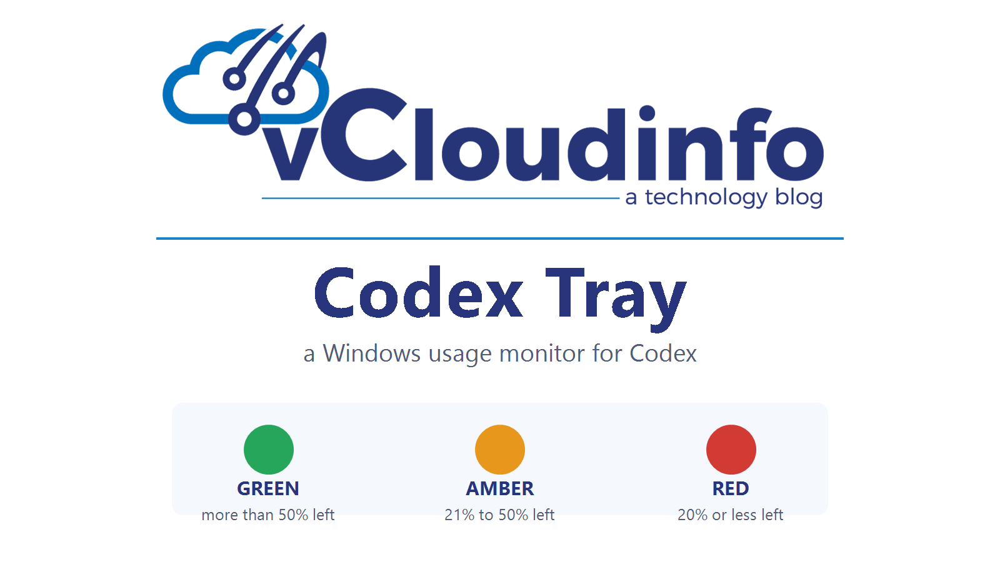
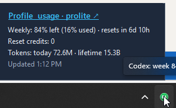
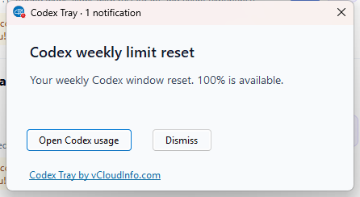

<p align="center">
  <a href="https://www.vcloudinfo.com"></a>
</p>

<p align="center">
  <a href="https://x.com/CCostan"></a>
  <a href="https://github.com/CCOSTAN"></a>
  <a href="https://www.youtube.com/vCloudInfo?sub_confirmation=1"></a>
</p>

<p align="center">A small Windows notification-area monitor for Codex usage limits.</p>

<p align="center">
  <a href="https://www.vcloudinfo.com"></a>
  <a href="https://github.com/CCOSTAN/Home-AssistantConfig"></a>
  <a href="https://github.com/CCOSTAN/CodexTray/actions/workflows/ci.yml"></a>
</p>

Codex Tray is a Bear Stone Smart Home utility from [vCloudInfo.com](https://www.vcloudinfo.com). Browse the larger collection in the [Bear Stone Smart Home repository](https://github.com/CCOSTAN/Home-AssistantConfig).

Read the launch article: [Codex Tray: Monitor OpenAI Codex Usage on Windows](https://www.vcloudinfo.com/2026/08/codex-tray-monitor-openai-codex-usage-windows.html).

This unofficial community project is not affiliated with OpenAI.

## What it does

- Hover over the tray icon to see the full short-window, weekly, credit, token, and update summary.
- Right-click the tray icon to open the menu. Left-click has no action.
- Click **Profile & usage** to open the [official Codex usage page](https://chatgpt.com/codex/cloud/settings/analytics#usage).
- Read the large, transparent percentage glyph in the icon: green above 50%, amber from 21% through 50%, and red at 20% or below.
- Receive a Windows notification and a taskbar window with a red **1** badge when the weekly window resets or OpenAI adds a reset credit.
- Pause polling while Windows is locked, then refresh after unlock.
- Refresh every five minutes or use **Refresh now**.
- Start with Windows through the current-user startup setting.

## Screenshots

<p align="center">
  
  <br>
  Hover over the installed tray icon for the full usage block.
</p>

<p align="center">
  
  <br>
  A weekly reset opens a taskbar window with a red 1 badge.
</p>

## Trust model

- The app uses OpenAI's documented [`codex app-server`](https://developers.openai.com/codex/app-server/) JSONL protocol.
- The app does not read `.codex/auth.json`, handle OAuth/API tokens, or make HTTP requests.
- Codex owns authentication and OpenAI network access.
- Codex Tray stores the last weekly reset timestamp, weekly usage, and reset-credit count under the current user's local application-data folder. It needs those values to recognize the next reset or credit.
- The app has no updater and no NuGet dependencies.
- Menu links open fixed HTTPS pages only after you click them.

## Build and verify

```powershell
dotnet build .\src\CodexTray\CodexTray.csproj -c Release
dotnet run --project .\tests\CodexTray.Tests\CodexTray.Tests.csproj -c Release
dotnet run --project .\tools\CodexTray.Probe\CodexTray.Probe.csproj -c Release
```

The probe makes a read-only request through the installed Codex CLI and prints a credential-free summary.

Use the same taskbar notification path without waiting for a real reset:

```powershell
dotnet run --project .\src\CodexTray\CodexTray.csproj -c Release -- --test-notification
```

Preview the hover card with current data:

```powershell
dotnet run --project .\src\CodexTray\CodexTray.csproj -c Release -- --test-hover
```

## Publish

```powershell
dotnet publish .\src\CodexTray\CodexTray.csproj -c Release -r win-x64 --self-contained true -p:PublishSingleFile=true -p:DebugType=None -p:DebugSymbols=false -o .\artifacts\publish
```

Run `CodexTray.exe` from the publish directory. The app requires no installer or administrator rights.

Windows may show an unknown-publisher warning because releases are not code-signed yet. Build from source if your environment requires a signed executable.

## Codex discovery

Codex Tray checks these locations in order:

1. `CODEX_TRAY_CODEX_PATH`, when it points to a `codex.exe` file.
2. The current user's Codex desktop installation.
3. `codex.exe` entries on `PATH`.

## More from Bear Stone Smart Home

- [vCloudInfo blog](https://www.vcloudinfo.com)
- [Bear Stone Smart Home repository](https://github.com/CCOSTAN/Home-AssistantConfig)
- [vCloudInfo on YouTube](https://www.youtube.com/vCloudInfo?sub_confirmation=1)

## License

MIT
